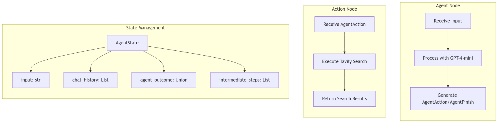

# LangGraph Agent Executor


Welcome to the **Langgraph Agent Executor**! This repository demonstrates how to build a custom agent using **LangChain**, **LangGraph**, and a lightweight `GPT-4o-mini` model. The project is set up in a single Jupyter Notebook, showcasing how to orchestrate tool usage and agent steps with a flow-based approach.

---

## Table of Contents

- [LangGraph Agent Executor](#langgraph-agent-executor)
  - [Table of Contents](#table-of-contents)
  - [Overview](#overview)
  - [Features](#features)
  - [Project Structure](#project-structure)
  - [Setup \& Installation](#setup--installation)
  - [Usage](#usage)
  - [Code Explanation](#code-explanation)
  - [Images](#images)
  - [Contributing](#contributing)

---

## Overview

This project demonstrates how to:

- Initialize a stateful agent that processes user input.  
- Use **Langgraph** to define a **StateGraph** workflow.  
- Dynamically execute tools (in this case, a Tavily search tool) based on the agent’s output.  
- Stream partial outcomes from a compiled runnable.  
- Make use of a small GPT-4–like model (gpt-4o-mini) to generate actions or final answers.  

---

## Features

1. **State Management**  
   - Stores user input and intermediate steps in an `AgentState` class.  
   - Keeps track of previous chat history and completed actions.  

2. **Agent-Tool Workflow**  
   - An **Agent Node** processes inputs and either finishes or creates an action.  
   - An **Action Node** executes a tool based on agent instructions.  
   - A simple conditional function determines if the workflow should continue.  

3. **LangChain & Langgraph Integration**  
   - Makes use of `create_openai_functions_agent` from LangChain.  
   - Defines a **StateGraph** that orchestrates nodes and transitions between them.  

4. **Streaming Support**  
   - The compiled `workflow.compile()` produces an object you can stream results from.  

---

## Project Structure

A suggested directory layout for this project is:

```
langgraph-agent-executor/
├─ .env                      # Stores sensitive API keys
├─ README.md                 # You are here 😉 !!!
├─ requirements.txt          # Python dependencies
├─ notebook.ipynb            # Jupyter Notebook with all code cells
├─ images/
│   ├─ cover_photo.jpeg
│   ├─ agent_flow_chart.png
│   └─ state_management_action_node.png
└─ ...
```

- **.env**  
  This file contains all the required API keys (like `GROQ_API_KEY`, `TAVILY_API_KEY`, etc.).  
- **notebook.ipynb**  
  Contains all the Python code, including the agent definition, environment checks, and final workflow compilation.

---

## Setup & Installation

1. **Clone the Repository**  
   ```bash
   git clone https://github.com/mayurasandakalum/agent-executor.git
   cd agent-executor
   ```

2. **Create (and activate) a Virtual Environment**  
   ```bash
   python -m venv venv
   source venv/bin/activate   # or venv\Scripts\activate on Windows
   ```

3. **Install Dependencies**  
   ```bash
   pip install -r requirements.txt
   ```

4. **Create and Populate Your `.env` File**  
   ```bash
   cp .env.example .env
   # Edit .env to include your API keys:
   # GROQ_API_KEY=...
   # TAVILY_API_KEY=...
   # etc.
   ```

5. **Run the Jupyter Notebook**  
   ```bash
   jupyter notebook
   ```
   Open `notebook.ipynb` in your browser and follow along.

---

## Usage

1. **Open the Jupyter Notebook**: Launch the notebook from your terminal as shown above.  
2. **Execute Cells Step-by-Step**: The notebook is separated into logical sections with comments. Click “Run” on each cell in sequence.  
3. **Check the Console/Notebook Output**:  
   - You will see prompts for any missing environment variables.  
   - The streaming output from the agent is printed in real time.  
4. **Results**: The final result (an `AgentFinish` or a continuing `AgentAction`) will be displayed at the end of the notebook execution.  

---

## Code Explanation

Below is a brief overview of key cells from the notebook:

1. **Environment Setup**  
   - Loads the `.env` file using `dotenv.load_dotenv()`.  
   - Prompts for any missing keys.  

2. **Tool Definition**  
   - Creates a list of tools (`TavilySearchResults`) that the agent can use.  

3. **LLM & Agent Creation**  
   - Pulls a prompt template via `hub.pull("hwchase17/openai-functions-agent")`.  
   - Initializes the GPT-4o-mini model `ChatOpenAI(model="gpt-4o-mini")`.  
   - Constructs the agent via `create_openai_functions_agent(llm, tools, prompt)`.  

4. **State & Workflow**  
   - Defines the typed dictionary `AgentState`, which stores:  
     - `input`, `chat_history`, `agent_outcome`, `intermediate_steps`  
   - Sets up a `StateGraph` with two main nodes:  
     - **Agent Node**: Runs the agent.  
     - **Action Node**: Executes tools.  
   - A conditional (`should_continue`) decides if the agent is done or should keep going.  

5. **Workflow Compilation**  
   - `workflow.compile()` builds a LangChain Runnable.  
   - Shows how to stream partial outcomes by iterating over `app.stream(inputs)`.  

---

## Images

Below are the images that illustrate the agent’s flow and state management:

1. **Flow Chart of the Agent**  
   

2. **State Management, Action Node, and Agent Node**  
   

These diagrams give a visual understanding of how data flows between nodes and how the agent makes decisions.

---

## Contributing

Contributions are welcome! If you find a bug or have a suggestion to improve this project:

1. Fork the repository  
2. Create a new feature branch (`git checkout -b feature/YourFeature`)  
3. Commit your changes (`git commit -m 'Add cool feature'`)  
4. Push to the branch (`git push origin feature/YourFeature`)  
5. Create a new Pull Request  

---

**Thank you for checking out the LangGraph Agent Executor!**  

If you have any questions, suggestions, or feedback, please open an issue or create a pull request. Have fun experimenting with your custom agent workflow!